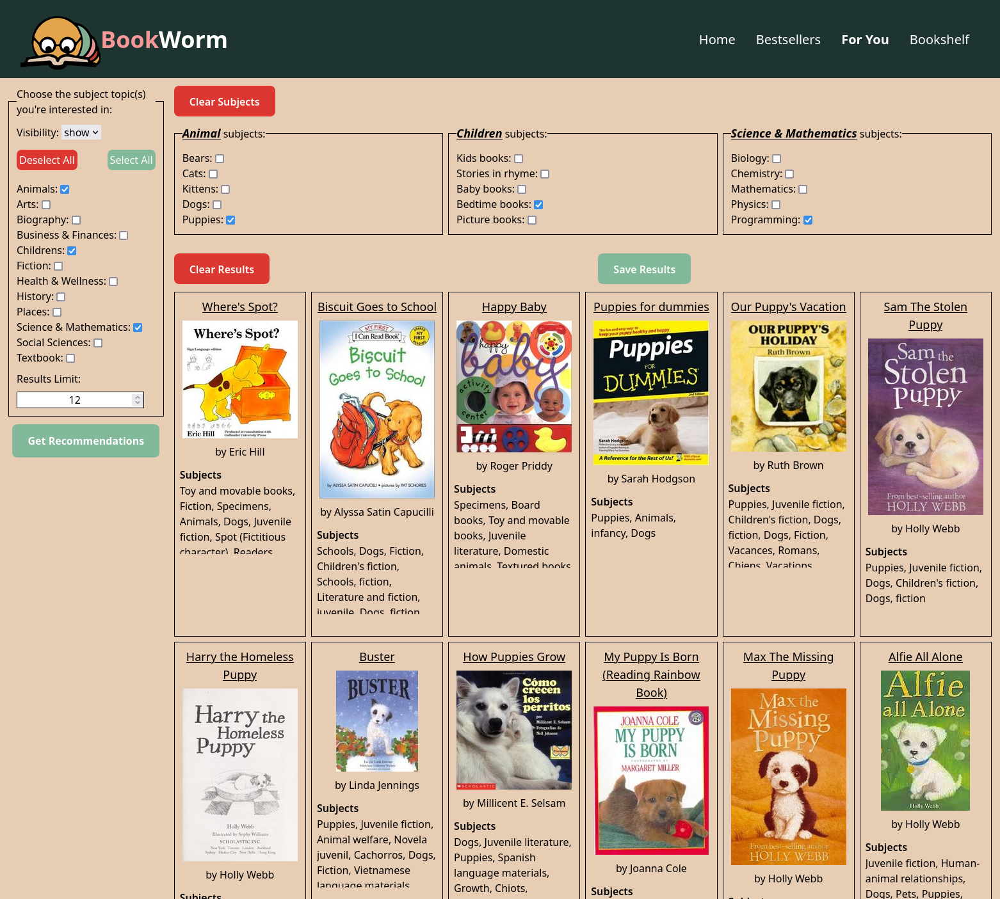

# BookWorm

## BookWorm - Your Literary Adventure Companion

Welcome to BookWorm, your portal to literary excellence and personalized reading adventures. With BookWorm, we utilize
data from multiple server-side APIs to provide you with personalized book recommendations that match your unique reading
interests. Our application is built on a polished UI, utilizing tailwindcss for a responsive and visually pleasing design.

### Key Features

* Personalized Recommendations: BookWorm uses advanced algorithms to curate book recommendations that align with your
  reading preferences.
* Genre Customization: Tailor your reading journey by selecting your favorite genres.
* Interactive Interface: Enjoy a highly interactive user interface with modals for smoother interactions.
* Server-Side APIs: We've harnessed data from multiple server-side APIs to ensure that you receive the most relevant book
  recommendations.
* Client-Side Storage: Your reading history and preferences are stored locally, offering a personalized and seamless
  experience.
* Responsiveness: BookWorm adapts gracefully to various screen sizes and devices.

### Technologies Used

* TypeScript
* Tailwind CSS
* Webpack
* Node.js
* Server-Side APIs: [NY Times](https://developer.nytimes.com/apis), [OpenLibrary](https://openlibrary.org/developers)
* Deployment: [Bookworm](https://snappergee.github.io/bookworm/)
* Client-Side Storage: Local storage for reading history and preferences

### Getting Started

Embark on your literary adventure with BookWorm:

1. Visit the BookWorm website.
1. Customize your reading preferences by selecting your favorite genres.
1. Explore handpicked book recommendations tailored to your tastes.
1. Enjoy an enhanced user experience with modals for interactions.
1. Access your reading history and personalized recommendations thanks to client-side storage.

### Screenshots

#### For You

The `For You` page offers a wide variety of subjects and topics to choose from and will provide a list of books tailored
to the selected subjects and topics.

Visit BookWorm today and immerse yourself in captivating stories tailored to your unique reading preferences!
